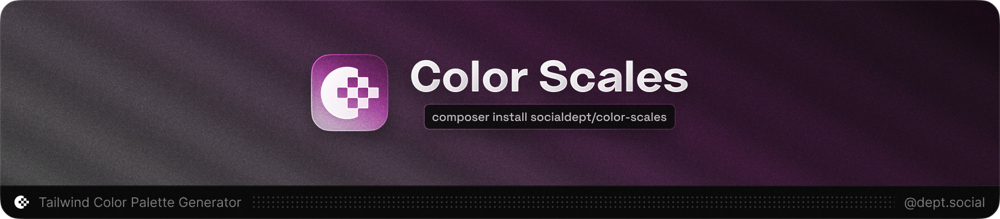

[](https://github.com/socialdept/color-scales)

<h3 align="center">
    Generate Tailwind-compatible color palettes from any input color.
</h3>

<p align="center">
    <br>
    <a href="https://packagist.org/packages/socialdept/color-scales" title="Latest Version on Packagist"></a>
    <a href="https://packagist.org/packages/socialdept/color-scales" title="Total Downloads"></a>
    <a href="https://github.com/socialdept/color-scales/actions/workflows/tests.yml" title="GitHub Tests Action Status"></a>
    <a href="LICENSE" title="Software License"></a>
</p>

---

## What is Color Scales?

**Color Scales** is a Laravel package that generates beautiful, Tailwind-compatible color palettes from any input color. Using perceptually uniform color spaces (OKLCH & HSLuv), it creates 11-shade palettes (50-950) that match the quality of professional color tools like [tints.dev](https://tints.dev) and [uicolors.app](https://uicolors.app).

Think of it as your personal color palette designer that understands color science.

## Why use Color Scales?

- **Matches tints.dev** - Generates palettes identical to the popular tints.dev tool
- **Perceptually uniform** - Uses OKLCH and HSLuv for visually consistent results
- **Automatic shade detection** - Intelligently determines where your input color fits (50-950)
- **Dual modes** - Choose between `perceived` (HSLuv) or `linear` (HSL) distribution
- **Multiple formats** - Export as `HEX`, `RGB`, `HSL`, `OKLCH`, or Tailwind config
- **RGB gamut clamping** - Automatically adjusts out-of-gamut colors

## Quick Example

```php
use SocialDept\ColorScales\Generator\ColorScaleGenerator;

$generator = new ColorScaleGenerator();

// Generate a palette from any color
$palette = $generator->generate('#d8b965');

// Get colors as hex values
$colors = $palette->toHex();
// [
//   '50' => '#f6f4e9',
//   '100' => '#ede9d3',
//   '200' => '#dbd3a7',
//   '300' => '#d8b965', // Input color (auto-detected as shade 300)
//   '400' => '#c9a94d',
//   ...
// ]

// Or export as Tailwind CSS config
$config = $palette->toTailwindConfig('gold');
// 'gold': {
//   50: '#f6f4e9',
//   100: '#ede9d3',
//   ...
// }
```

## Installation

```bash
composer require socialdept/color-scales
```

## Basic Usage

### Generating Palettes

Color Scales accepts multiple input formats:

```php
use SocialDept\ColorScales\Generator\ColorScaleGenerator;

$generator = new ColorScaleGenerator();

// From hex
$palette = $generator->generate('#511ef3');

// From RGB
$palette = $generator->generate('rgb(81, 30, 243)');

// From HSL
$palette = $generator->generate('hsl(254, 88%, 54%)');

// From OKLCH
$palette = $generator->generate('oklch(0.48 0.29 275)');
```

### Choosing a Mode

Select between **perceived** (default, matches tints.dev) or **linear** mode:

```php
// Perceived mode (HSLuv) - perceptually uniform, best for design
$palette = $generator->generate('#d8b965', ['mode' => 'perceived']);

// Or use the convenience method
$palette = $generator->generatePerceived('#d8b965');

// Linear mode (HSL) - mathematically simple
$palette = $generator->generate('#d8b965', ['mode' => 'linear']);

// Or use the convenience method
$palette = $generator->generateLinear('#d8b965');
```

**Perceived mode** uses relative luminance for shade detection and HSLuv for color generation, matching tints.dev's output exactly. **Linear mode** uses HSL lightness for both, producing a simpler mathematical distribution.

### Advanced Options

Customize palette generation with additional parameters:

```php
$palette = $generator->generate('#511ef3', [
    'mode' => 'perceived',    // 'perceived' or 'linear'
    'h' => 0,                 // Hue shift amount
    's' => 0,                 // Saturation shift amount
    'lMin' => 0,              // Minimum lightness (darkest shade)
    'lMax' => 100,            // Maximum lightness (lightest shade)
    'valueStop' => 500,       // Force input color to specific shade (auto-detected by default)
]);
```

### Export Formats

Export your palette in multiple formats:

```php
$palette = $generator->generate('#511ef3');

// Hex strings
$hex = $palette->toHex();
// ['50' => '#f2f1ff', '100' => '#e7e6ff', ...]

// RGB strings
$rgb = $palette->toRgb();
// ['50' => 'rgb(242, 241, 255)', ...]

// HSL strings
$hsl = $palette->toHsl();
// ['50' => 'hsl(245, 100%, 97%)', ...]

// OKLCH strings
$oklch = $palette->toOklch();
// ['50' => 'oklch(0.975 0.02 275)', ...]

// Tailwind CSS v4 config format (@theme) - OKLCH (default)
$config = $palette->toTailwindV4Config('primary', 'oklch');
// @theme {
//   --color-primary-50: oklch(0.975 0.02 275);
//   --color-primary-100: oklch(0.95 0.04 275);
//   ...
// }

// Tailwind CSS v4 config format - HEX
$config = $palette->toTailwindV4Config('primary', 'hex');
// @theme {
//   --color-primary-50: #f2f1ff;
//   --color-primary-100: #e7e6ff;
//   ...
// }

// Tailwind CSS v4 config format - RGB
$config = $palette->toTailwindV4Config('primary', 'rgb');
// @theme {
//   --color-primary-50: rgb(242 241 255);
//   --color-primary-100: rgb(231 230 255);
//   ...
// }

// Tailwind CSS v4 config format - HSL
$config = $palette->toTailwindV4Config('primary', 'hsl');
// @theme {
//   --color-primary-50: hsl(245.0 100.0% 97.3%);
//   --color-primary-100: hsl(245.0 100.0% 95.1%);
//   ...
// }

// Tailwind CSS v3 config format (OKLCH with alpha)
$config = $palette->toTailwindV3Config('primary', 'oklch');
// 'primary': {
//   50: 'oklch(0.975 0.02 275 / <alpha-value>)',
//   100: 'oklch(0.95 0.04 275 / <alpha-value>)',
//   ...
// }

// Tailwind CSS v3 config format (HEX - legacy)
$config = $palette->toTailwindV3Config('primary', 'hex');
// 'primary': {
//   50: '#f2f1ff',
//   100: '#e7e6ff',
//   ...
// }

// Array (alias for toHex)
$array = $palette->toArray();
```

### Accessing Individual Shades

Get specific shades or all Color objects:

```php
$palette = $generator->generate('#511ef3');

// Get a specific shade
$shade500 = $palette->getShade(500);

// Access color properties
$oklch = $shade500->toOklch();
// ['l' => 0.48, 'c' => 0.29, 'h' => 275]

// Get all Color objects
$colors = $palette->getColors();
// [50 => Color, 100 => Color, ..., 950 => Color]
```

## Use Cases

### Tailwind CSS Theme

```php
$generator = new ColorScaleGenerator();

$colors = [
    'primary' => $generator->generate('#3b82f6'),
    'success' => $generator->generate('#10b981'),
    'warning' => $generator->generate('#f59e0b'),
    'danger' => $generator->generate('#ef4444'),
];

// Export for Tailwind v4 (CSS @theme)
foreach ($colors as $name => $palette) {
    echo $palette->toTailwindV4Config($name) . "\n\n";
}

// Or export for Tailwind v3 (OKLCH with alpha support)
foreach ($colors as $name => $palette) {
    echo $palette->toTailwindV3Config($name, 'oklch') . "\n\n";
}
```

### Dynamic Theming

```php
// User selects brand color
$brandColor = $request->input('brand_color');

// Generate complete palette
$palette = $generator->generate($brandColor);

// Store in database or cache
cache()->put("brand_palette_{$userId}", $palette->toHex(), now()->addDay());
```

### Design System Generator

```php
// Generate multiple palettes from a base color
$baseColor = '#511ef3';

$palettes = [
    'default' => $generator->generate($baseColor),
    'vibrant' => $generator->generate($baseColor, ['s' => 10]),
    'muted' => $generator->generate($baseColor, ['s' => -10]),
];

// Export as CSS variables
foreach ($palettes['default']->toHex() as $shade => $hex) {
    echo "--color-{$shade}: {$hex};\n";
}
```

### Accessibility Tool

```php
// Generate palette and analyze contrast
$palette = $generator->generate('#2563eb');

$textColor = $palette->getShade(50)->toHex();  // Light text
$bgColor = $palette->getShade(900)->toHex();   // Dark background

// Calculate contrast ratio for accessibility
// (integrate with your contrast checker)
```

## Testing

The package includes comprehensive tests validating palette generation accuracy:

```bash
./vendor/bin/phpunit
```

Tests ensure generated palettes match tints.dev output within acceptable tolerance.

## Requirements

- PHP 8.2+
- Laravel 11+ (optional - package works standalone)
- `hsluv/hsluv` ^2.0 - HSLuv color space conversions

## Resources

- [tints.dev](https://tints.dev) - Color palette generator inspiration
- [OKLCH Color Space](https://oklch.com/) - Perceptually uniform colors
- [HSLuv](https://www.hsluv.org/) - Human-friendly HSL alternative
- [Tailwind CSS](https://tailwindcss.com/docs/customizing-colors) - Color palette system

## Support & Contributing

Found a bug or have a feature request? [Open an issue](https://github.com/socialdept/color-scales/issues).

Want to contribute? We'd love your help! Check out the [contribution guidelines](CONTRIBUTING.md).

## Credits

- [Miguel Batres](https://batres.co) - founder & lead maintainer
- Inspired by [tints.dev](https://tints.dev) by [Simeon Griggs](https://simeongriggs.dev)

## License

Color Scales is open-source software licensed under the [MIT license](LICENSE).

---

**Built for Tailwind Developers** • By Social Dept.
